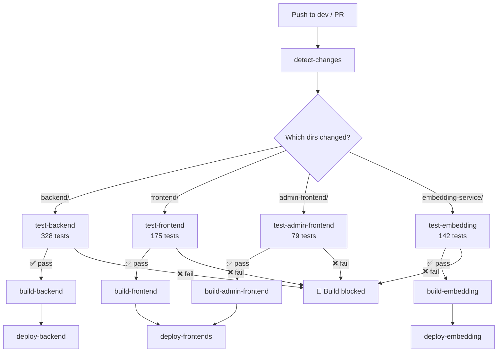

# CI/CD Pipeline — Test Integration Documentation

## Overview

The CI/CD pipeline enforces automated testing as a **quality gate** before any Docker image is built or deployed. No code reaches production without passing its test suite.

## Pipeline Architecture



## Workflow Files

### `test.yml` — Standalone Test Runner

| Field | Value |
|-------|-------|
| **Triggers** | Push to `dev`/`main`, Pull Requests to `dev`/`main` |
| **Purpose** | Run tests independently for PR checks & CI status |
| **Outputs** | JUnit XML reports uploaded as artifacts (30-day retention) |

#### Jobs

| Job | Condition | Tests | Runtime |
|-----|-----------|-------|---------|
| `test-backend` | `backend/` changed | 328 pytest tests | Python 3.12 |
| `test-frontend` | `frontend/` changed | 175 Vitest tests | Node 20 |
| `test-admin-frontend` | `admin-frontend/` changed | 79 Vitest tests | Node 20 |
| `test-embedding` | `embedding-service/` changed | 142 pytest tests | Python 3.12 |
| `tests-passed` | Always | Aggregate gate check | — |

### `deploy.yml` — Build & Deploy (Updated)

The deploy pipeline now follows this order:

```
detect-changes → test-* → build-* → deploy-*
```

Each build job has a **hard dependency** on its test counterpart:

| Build Job | Depends On | Blocked When |
|-----------|------------|--------------|
| `build-frontend` | `test-frontend` | Tests fail |
| `build-admin-frontend` | `test-admin-frontend` | Tests fail |
| `build-backend` | `test-backend` | Tests fail |
| `build-embedding` | `test-embedding` | Tests fail |
| `build-scraper` | `detect-changes` only | No tests yet |

> **Note:** The scraper engine currently has no test suite. Build proceeds without a test gate.

## Change Detection

Both workflows use **path-based detection** to skip irrelevant jobs:

| Pattern | Triggers |
|---------|----------|
| `backend/` | Backend tests + build |
| `frontend/` | Frontend tests + build |
| `admin-frontend/` | Admin frontend tests + build |
| `microservices/embedding-service/` | Embedding tests + build |
| `deploy/server*` | Deploy config sync |

**`deploy_all` override:** The `workflow_dispatch` input forces all components to test, build, and deploy.

## Test Artifacts

The `test.yml` workflow uploads JUnit XML reports for each component:

| Artifact | Contents | Retention |
|----------|----------|-----------|
| `backend-test-results` | `unit.xml`, `integration.xml`, `schema.xml` | 30 days |
| `frontend-test-results` | `vitest.xml` | 30 days |
| `admin-frontend-test-results` | `vitest.xml` | 30 days |
| `embedding-test-results` | `embedding.xml` | 30 days |

These can be viewed in the GitHub Actions **Artifacts** tab or parsed by third-party tools.

## Test Coverage Summary

| Component | Unit | Integration | Schema | Total |
|-----------|------|-------------|--------|-------|
| Backend | 180 | 102 | 46 | **328** |
| Frontend | 175 | — | — | **175** |
| Admin Frontend | 79 | — | — | **79** |
| Embedding Service | 60 | 44 | 38 | **142** |
| **Grand Total** | | | | **724** |

## How It Works

### On Pull Request

1. `test.yml` runs → tests execute → status check appears on PR
2. Failed tests **block the PR merge** (if branch protection is enabled)
3. Test results are downloadable as artifacts

### On Push to `dev`

1. `test.yml` runs tests (for CI status)
2. `deploy.yml` runs in parallel:
   - `detect-changes` → `test-*` → `build-*` → `deploy-*`
   - If any `test-*` job fails, the corresponding `build-*` and `deploy-*` are **skipped**
   - Other components are unaffected (isolated pipelines)

### Recommended Branch Protection Rules

To enforce the test gate, configure these **required status checks** on `dev`:

- `tests-passed` (from `test.yml`)

This ensures no PR can merge unless all affected test suites pass.

## Adding Tests for New Components

To add a new test job:

1. Create tests in the component's directory
2. Add a `test-<component>` job in both `test.yml` and `deploy.yml`
3. Add the test job as a dependency for the corresponding `build-<component>` job
4. Add the change detection pattern in `detect-changes`
