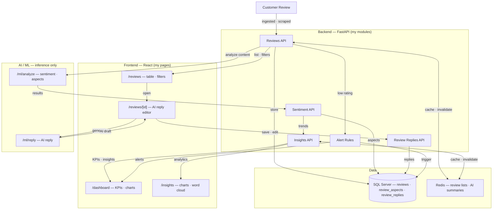

# Workload Diagram — Reviews, AI Reply & Insights Dashboard

| | |
|---|---|
| **Student** | P.D. Hettiarachchi |
| **Registration No.** | 234080F |
| **Project** | Hotel & Restaurant Review Analysis & Response System |
| **Team** | LETHYS |
| **Module** | Reviews, AI Reply & Insights Dashboard |

## System Diagram — My Module

**How it works:** Customer reviews are ingested by the Reviews API → stored in SQL Server (`reviews` · `review_aspects` · `review_replies`) → analyzed for sentiment and aspects through the LLM Gateway (`/ml/analyze`) → aggregated into KPIs, trends, and analytics for the Dashboard and Insights pages → AI replies are generated (`/ml/reply`), reviewed and edited by managers on the review detail page, then saved as the final response. Low ratings trigger automatic alert rules, and Redis caches review lists and AI summaries with automatic invalidation.

**Review lifecycle:** Customer Review → Review Storage → Sentiment / Aspect Analysis → Review Insights & Trends → AI Reply Generation → Manager Reviews / Edits Reply → Final Response

**Parallel flows:** Review Data → Aggregation → Dashboard KPIs → Charts → Insights · Low Rating → Alert Trigger
