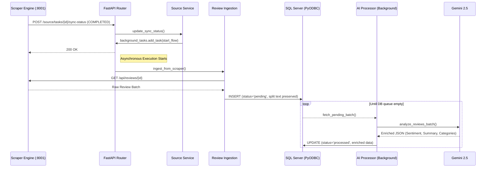

# Backend System Knowledge Base

## 1. System Overview
The backend of the Hotel and Restaurant Review Management System is a production-grade **Domain-Driven Modular Monolith** built with **FastAPI**. Its primary goal is to provide a secure, high-performance API that aggregates, processes, and analyzes review data from various hospitality platforms. The system uses a decoupled architecture where an external **Scraper Engine** provides raw review data via webhooks, which are then analyzed using the **Google Gemini 2.5** asynchronous pipeline.

## 2. Architecture & File Structure
This project utilizes a **Domain-Driven Design (DDD)** structure, isolating business logic within discrete modules.

```text
backend/
├── app/
│   ├── main.py                     # Thin entry point, application lifespan config, and route registration
│   ├── core/                       # Infrastructure layer
│   │   ├── config.py               # Centralized environment configurations
│   │   ├── db_utils.py             # PyODBC database querying wrappers
│   │   └── security.py             # Security, token generation, and OAuth
│   ├── database/                   # ORM database configuration
│   │   └── session.py              # SQLAlchemy engine and session management
│   ├── middleware/                 # Cross-cutting layers (Permissions, Auth Guards)
│   ├── modules/                    # Self-contained Domain Modules
│   │   ├── admin/                  # User, Organization role administration
│   │   ├── auth/                   # Authentication logic, OAuth, token resets
│   │   ├── competitors/            # Competitor benchmarking & analytics
│   │   ├── dashboard/              # Global KPI aggregation and dashboard feeds
│   │   ├── groups/                 # Collaborative group entity management
│   │   ├── reviews/                # Core review processing and AI enrichment
│   │   ├── scheduler/              # APScheduler logic for background jobs
│   │   ├── source/                 # Scraping source/platform registry
│   │   └── user/                   # User profile and preference management
│   ├── repositories/               # Data Access Layers (DAL) shielding business logic
│   ├── schemas/                    # Pydantic validation schemas
│   ├── services/                   # High-level business logic
│   └── test/                       # Connectivity, AI, and initial integration tests
├── scripts/                        # Database seeding/migration tools
├── requirements.txt                # System dependencies
└── .env.example                    # Template for required environment variables
```

## 3. Core Workflows & Data Flow

### The Data Extraction & Enrichment Lifecycle



1. **Triggering**: A sync status update is sent from the **Scraper Engine** to the `/sync-status` webhook. If the status is `COMPLETED`, the Review Processing Pipeline is triggered via `BackgroundTasks`.
2. **Ingestion**: The backend environment communicates back to the engine over port `8001` to fetch the raw review batch. Reviews are stored immediately in the `processed_review` table with a status of `'pending'`. Split text components (Positive/Negative) are preserved from the source.
3. **AI Enrichment**: A background processor fetches `'pending'` reviews in batches and sends them to **Google Gemini 2.5**. The pipeline now processes in a loop until all pending reviews are handled (up to 50 consecutive batches).
4. **Monitoring**: The real-time status of the processing pipeline (Pending vs Processed counts) is available via the `/api/reviews/processing/status` endpoint, providing a clear view of system throughput and any stalled tasks.
5. **Resilience**: The system tracks `retry_count` and `error_message` for every review. Failed AI calls are retried up to 3 times before being flagged.
6. **Retrieval**: Enriched data is served via the `/api/reviews` endpoints, providing the frontend with deep insights, photos, and drafted AI replies.

## 4. Interfaces & APIs

### Exposed Endpoints
The backend primarily operates under `/api` for domain-specific interfaces:
- **Health & Infra**: `/health`, `/db-test`
- **Auth**: `/api/auth/login`, `/api/auth/oauth/google`, `/api/auth/refresh`
- **Administration**: `/api/admin/users`, `/api/admin/organizations`
- **Reviews**: `/api/reviews/{org_id}`, `/api/reviews/trigger/{src_id}`, `/api/reviews/process/{review_id}`, `/api/reviews/generate-reply`, `/api/reviews/processing/status`
- **Source/Sync**: `/api/source/tasks/{id}/sync-status`
- **Data Access**: `/api/competitors`, `/api/dashboard`

### Consumed APIs / External Connections
- **Google Generative AI (Gemini)**: Analyzes review text.
- **Google OAuth**: Authenticates users.
- **Supabase (Storage)**: Optional external cloud storage bucket.
- **SMTP Relay**: Outbound connections to `smtp.gmail.com` for password reset emails.

## 5. Dependencies & Environment

### Core Dependencies
- **FastAPI / Uvicorn**: Async API framework and ASGI server.
- **SQLAlchemy & PyODBC**: Dual-pronged data access layer.
- **Pydantic**: Deep payload and configuration validation.
- **Playwright**: Headless browsing for uncooperative data sources.
- **APScheduler**: Task orchestration without relying on a full Celery/Redis stack.
- **google-genai / anthropic**: LLM SDK integrations.

### Key Environment Variables
- `DATABASE_URL`: SQLAlchemy connection string (`mssql+pyodbc://...`).
- `DB_SERVER`, `DB_NAME`, `DB_UID`, `DB_PWD`: Direct pyodbc credentials.
- `SECRET_KEY`, `JWT_SECRET_KEY`: Cryptographic signing keys for application sessions and JWTs.
- `GENAI_KEY`: Authentication key for Google Gemini inferences.
- `GOOGLE_CLIENT_ID`, `GOOGLE_CLIENT_SECRET`: Used for `authlib` to process OAuth handshakes.
- `SMTP_*`: Keys for dispatching emails.

## 6. Error Handling & Edge Cases
- **Global Error Fallback**: A global `@app.exception_handler(Exception)` captures unexpected exceptions, writing them to a `backend_error.log` while returning a 500 status with valid CORS headers to prevent frontend cross-origin mask errors.
- **Database Resilience**: Uses `pool_pre_ping=True` in SQLAlchemy to recover from stale connections. PyODBC connections are strictly enclosed and use driver fallback logic.
- **Scraping Limitations**: Target websites block bots over time. Web scrapers operate headlessly via BackgroundTasks and have inherent timeout configurations to elegantly fail rather than blocking the main thread.
- **Validation**: Pydantic tightly enforces schemas at the route border, dropping malicious or malformed request payloads via `HTTPException(422)`.

## 7. LLM Context & Agent Rules
**ATTENTION AI AGENTS:** READ THIS BEFORE MODIFYING CODE.
1. **Source of Truth Check**: Do not recreate database utilities in modules. Rely on `app.core.db_utils` for pyodbc and `app.database.session` for ORM.
2. **Circular Dependencies**: Domain boundaries are strict. `modules.admin` must not import from `modules.reviews` unless explicitly designed as an abstraction. Rely purely on Pydantic schema passing if necessary.
3. **Dual DB Layer Logic**: Remember that *ORM/SQLAlchemy* is heavily utilized for structured User, Auth, Roles, and Groups setups. *Raw PyODBC (`db_utils`)* is heavily utilized for high-performance extraction tasks, analytical dashboards, and reviews. 
4. **Environment Fallbacks**: Always provide fallbacks if missing environment variables are gracefully bypass-able. Catch `ImportError` gracefully when initializing optional external integrations.
5. **No Blind Global Mutability**: Never introduce global states outside of controlled singletons like the SQLAlchemy `engine` or `Base`.
6. **Error Forwarding**: Use `traceback.format_exc()` effectively in error handlers so agents reviewing logs can pinpoint failure lines. Do not mask stack traces.
