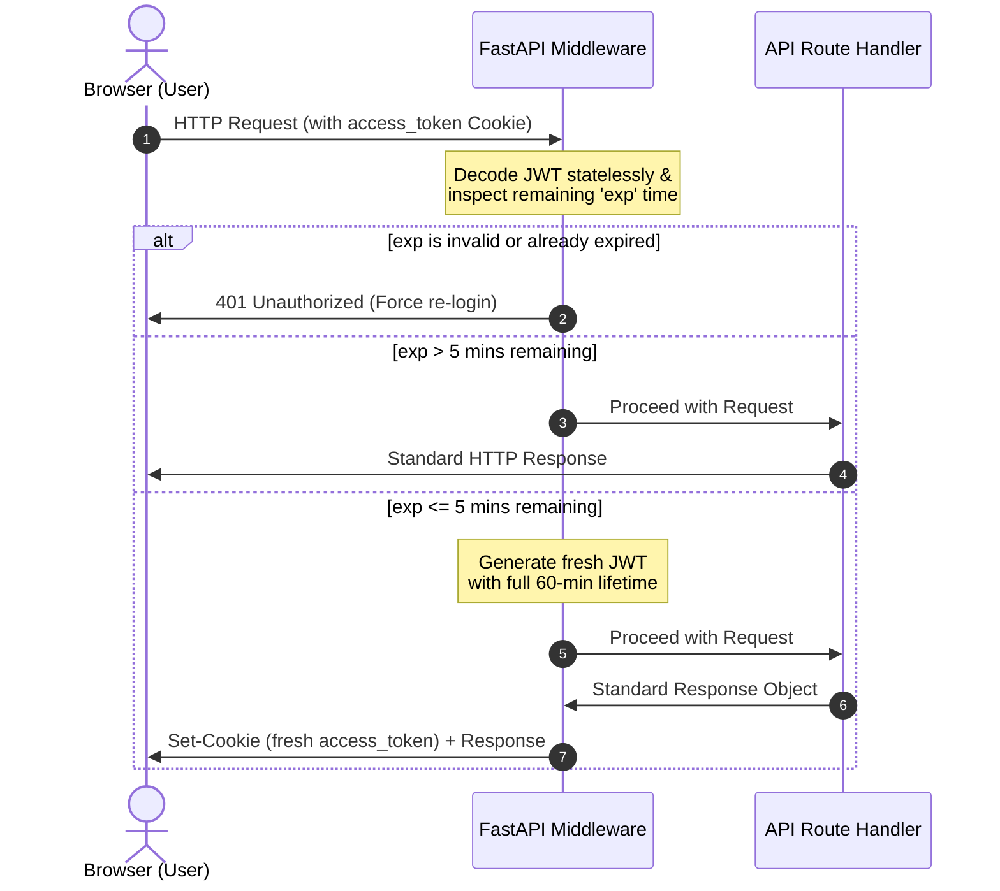

# Authentication Security Guide

This document provides a comprehensive security overview of the authentication, session management, and sliding expiration mechanisms implemented within the Hotel & Restaurant Review Management System.

---

## 🔒 1. Session Architecture (Secure Cookies)

The system employs a browser-managed, secure, stateless token delivery architecture. Rather than relying on client-side storage, session authority resides strictly under secure cookies managed automatically by the user agent.

### Cookie Configuration Matrix

All session-related cookies issued by the backend adhere to the following strict security flags:

| Attribute | Value | Description |
| :--- | :--- | :--- |
| **Name** | `access_token` | The canonical session cookie key. |
| **HttpOnly** | `True` | **Crucial Shield**: Prevents client-side scripts (javascript) from reading the cookie value, mitigating the risk of token exfiltration via Cross-Site Scripting (XSS). |
| **Secure** | `True` *(Production)* | Enforces cookie transmission exclusively over encrypted HTTPS connections. |
| **SameSite** | `Lax` | Restricts cookie sending on cross-site requests, providing robust protection against Cross-Site Request Forgery (CSRF) for standard navigation flows. |
| **Path** | `/` | Scopes the cookie to the entire application route hierarchy. |

---

## 🔄 2. Sliding Sessions (Stateless Automatic Extension)

To avoid abrupt logouts while a user is actively using the application, the system uses a **Sliding Sessions** model implemented via a lightweight, high-performance HTTP middleware.

### Expiration and Expiry Flow



### Security Benefits of the Stateless Slide
1. **No Database Overhead**: Extension decisions are computed on-the-fly inside FastAPI memory using cryptographically secure JWT signatures. No database lookups are triggered.
2. **Minimal Rotation Overheads**: Tokens are only rotated when they enter their final 5-minute validity window, avoiding excessive signature overheads.
3. **Defense in Depth**: If a token is stolen or copied, its natural expiration is short. It cannot be refreshed indefinitely without initiating continuous, real user-agent traffic.

---

## 🛡️ 3. Threat Model and Mitigations

The session architecture is designed to proactively defend against common web application vulnerabilities.

### Mitigation Overview

| Threat Vector | Mitigation Strategy | Implemented Mechanism |
| :--- | :--- | :--- |
| **Cross-Site Scripting (XSS) Token Theft** | Complete isolation of session secrets from JS execution scope. | **HttpOnly flag** enforced on the `access_token` cookie. Even if XSS occurs, `document.cookie` cannot read the token. |
| **Cross-Site Request Forgery (CSRF)** | Restriction of cookie transfer under cross-origin contexts. | **SameSite=Lax** configuration. Additionally, we enforce custom security headers and CORS origin restrictions. |
| **Dual Trust Source Vulnerability** | Elimination of redundant client-side JWT fallbacks. | **Test-Only Gating**: Client-side storage token reading is completely disabled in production and strictly confined to unit test runtimes. |
| **Session Bloat / Infinite Sessions** | Strict, non-negotiable lifetime constraints on sessions. | **Hard Expirations**: Tokens have a preconfigured lifetime (e.g., 60 minutes) and require a standard password re-entry once expired. |

---

## 🚀 4. Recommended Future Upgrade: Refresh Token Rotation (RTR)

While the sliding session model is highly performant and secure for standard scopes, moving to an **Enterprise-Grade Refresh Token Rotation** strategy adds a higher layer of security.

### How Refresh Token Rotation (RTR) Prevents Stolen Token Abuse

1. **Dual Token Issuance**: On login, the system issues a short-lived **Access Token** (e.g., 15 minutes) and a rotating **Refresh Token** (e.g., 7 days).
2. **Rotation on Use**: Whenever the access token expires, the client exchanges the refresh token for a *new* access token and a *new* refresh token. The old refresh token is instantly invalidated.
3. **Breach/Theft Detection**: If an attacker steals a refresh token and attempts to reuse it:
   - The backend detects that the token was *already used* (due to a database-backed family ledger).
   - The backend immediately raises a security tripwire.
   - **Both the stolen session and the active user's current session are instantly revoked**, forcing a complete password or multi-factor re-authentication.

---

## 🛠️ 5. Troubleshooting & Developer Guidelines

### How to Inspect Session Cookies (Local Dev)
1. Open your browser DevTools (F12).
2. Navigate to the **Application** (Chrome/Edge) or **Storage** (Firefox) tab.
3. Under **Cookies**, select `http://localhost:5173` or `http://localhost:5174`.
4. Confirm `access_token` is present, and check that the **HttpOnly** and **Secure** (if testing production build) columns have checkmarks.

### Running Security Tests
We maintain integration tests to verify session safety:
```powershell
# Run backend security tests
pytest tests/integration/test_sliding_sessions.py
pytest tests/integration/test_sprint2_security.py
```
Ensure all tests remain green before deploying code changes.
