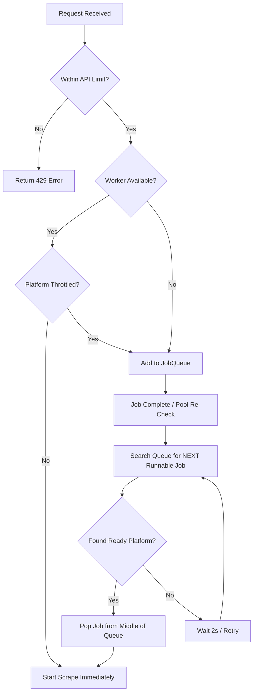

# Technical Documentation: Rate Limiting & Domain-Aware Scheduling

This document explains the protection architecture of the Scraper Engine, designed to prevent service overloads and minimize IP bans from target platforms.

---

## 🏗️ Two-Tier Protection Architecture

The system implements security at two distinct layers:

### 1. API-Level Throttling (SlowAPI)
Located in `api/main.py`, this layer protects the microservice from being overwhelmed by too many incoming REST requests. 
- **Tool**: `slowapi` library.
- **Storage**: In-memory (resets on service restart).
- **Behavior**: Returns `429 Too Many Requests` if thresholds are exceeded.

### 2. Domain-Aware Scheduling (Throttler)
Located in `core/throttler.py` and `core/scrape_pool.py`, this layer protects our IP address from target platform detection.
- **Tool**: Custom `Throttler` singleton + `JobQueue.pop_runnable()`.
- **Behavior**: If multiple jobs for the same platform (e.g., Google) are queued, they are spaced out by a configurable delay, even if workers are idle.

---

## 🔄 Job Processing Workflow

The diagram below illustrates how the **Smart Scheduler** picks the next job to run:



---

## ⚙️ Configuration Variables

These values can be tuned in the `.env` file to balance speed vs. stealth:

| Variable | Default | Description |
|----------|---------|-------------|
| `MAX_QUEUE_SIZE` | 100 | Max number of `PENDING` jobs before rejecting new ones. |
| `RATE_LIMIT_SCRAPE` | 10/minute | Max frequency of scrape triggers per client IP. |
| `DELAY_GOOGLE` | 30.0s | Minimum silence period between two Google Maps crawls. |
| `DELAY_TRIPADVISOR`| 40.0s | Minimum silence period between two TripAdvisor crawls. |
| `DELAY_AGODA` | 20.0s | Minimum silence period between two Agoda crawls. |

---

## 🛠️ Handling 429 Errors

When the rate limit is hit, the API returns a JSON error:

```json
{
  "error": "Rate limit exceeded: 10 per 1 minute"
}
```

**Recommendation for Backend**: If you receive a 429, implement an exponential backoff (starting at 5 seconds) before retrying the request.
