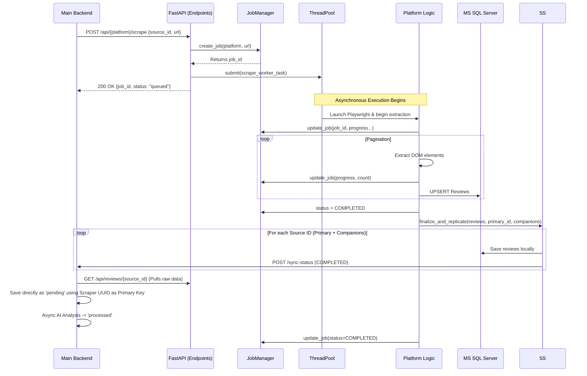

# 🕷️ Scraper Engine – Technical Documentation & Knowledge Base

This file serves as the absolute source of truth for the `scraper_engine` microservice. It is designed to be consumed by human engineers and AI agents to understand the system architecture, workflows, constraints, and data flows.

## 1. System Overview

The Scraper Engine is a highly decoupled, stateful, and concurrent Python microservice built with **FastAPI** and **Playwright**.
Its primary responsibility is to natively browse web properties (Agoda, Booking.com, Google Maps, TripAdvisor), extract raw customer reviews via DOM scraping, and insert normalized data into a centralized Microsoft SQL Server datastore.

**Key Characteristics:**
- **Asynchronous & Concurrent**: Uses an in-memory ThreadPool (`core/scrape_pool.py`) to prevent blocking FastAPI’s single event loop while Playwright instances execute.
- **Multi-Source URL Sharing**: Multiple `source_id`s can map to the exact same `source_url`. The engine identifies active overlaps and shares a single browser instance to fulfill all associated sources (Approach 1: Post-Scrape Replication).
- **Callback Driven**: Scrapes fire an async webhook `POST` to the master backend upon completion for every involved `source_id`.
- **Stateful Memory Loop**: An in-memory Job Manager (`core/job_manager.py`) tracks live browser progress, exposed via SSE or static endpoints. It also maintains URL-to-Job mappings to prevent redundant work.

---

## 2. Architecture & File Structure

```text
microservices/scraper_engine/
├── api/
│   ├── main.py                       # FastAPI Mount points & Swagger config
│   ├── endpoints/                    # Routing layer for Platforms & System logic
│   └── middleware/                   # Audit logging interception layer
├── core/
│   ├── config.py                     # Pydantic Settings & Environment parsing
│   ├── database.py                   # SQLAlchemy Engine & Session scoping
│   ├── job_manager.py                # In-Memory job tracking state machine
│   ├── models.py                     # Declarative Models mapping schema definitions
│   ├── queue.py                      # (If implemented) Additional queue mechanics
│   ├── scrape_pool.py                # Concurrent execution bounds (ThreadPoolExecutor) 
│   └── utils.py                      # Callbacks and notification triggers
├── platforms/                        # The Scraper Brains
│   ├── agoda/                        # [Browser setup] -> [Logic wrapper] -> [DOM extractor]
│   ├── booking/                      # Same structure per platform
│   ├── google/                       
│   └── tripadvisor/                  
├── scripts/                          # Isolated maintenance, dev, and DB debugging scripts
├── tests/                            # Pytest suites
└── requirements.txt                  # Strict unpinned dependencies
```

### Core Architecture Concepts
- **Controllers** (`api/endpoints/*.py`): Accept POST payloads, create a Job ID in `JobManager`, dispatch the payload to the specific platform in `platforms/{platform}/logic.py` using `ThreadPoolExecutor`, and return the Job ID immediately (HTTP 202-like behavior).
- **Core Models** (`core/models.py`): The `reviews` table is a super/subset hub. Each `review` record connects `1:1` with a platform-specific table (e.g. `booking_reviews`) ensuring no `NULL` sprawl across unshared columns.
- **Auditing** (`models.AuditLog`, `middleware`): Global HTTP call trapping for troubleshooting.

---

## 3. Core Workflows & Data Flow

### The Scrape Lifecycle (Sequence)



### In-Memory State
The `job_manager.py` maintains an active dictionary. Progress is determined by comparing `current_page`/`total_pages` or extrapolating parsed item counts. State updates strictly happen safely outside async boundaries or inside locked contexts.

---

## 4. Interfaces & APIs

### External APIs
- **Consumed**: `POST {BACKEND_API_URL}/source/tasks/{source_id}/sync-complete`
    - Payload contains count context. Retries up to 3 times on failure.

### Exposed Internal API Surface (Port 8001)
*Prefix: `/api`*
- **Scraping**: `POST /{platform}/scrape`. Body requires `source_id`, `url`. 
    - Returns `200 OK` with `status: "submitted"` for new jobs.
    - Returns `200 OK` with `status: "attached"` if an active scrape for that URL is already running. The new `source_id` is registered and will receive data once the existing job completes.
- **System**:
    - `GET /system/health`
    - `GET /system/jobs` (Returns volatile state memory tree)
    - `GET /system/pool`
- **Data Management**:
    - `GET /reviews/{source_id}` (Retrieves all reviews for a source, includes full platform detail)
    - `GET /reviews/unembedded/{source_id}` (Retrieves reviews with `is_embedded=False`)
    - `PATCH /reviews/mark-embedded` (Marks reviews as embedded after backend processing)
    - `DELETE /reviews/{review_id}` (Deletes a review by UUID. Cascades automatically via SQLAlchemy and DB constraints to purge all platform-specific child rows and media attachments.)
    - `GET /db/stats`, `POST /db/vacuum`

---

## 5. Dependencies & Environment

### Core Dependencies (Python 3.9+)
- **fastapi & uvicorn**: ASGI Server layer.
- **sqlalchemy 2.0+**: ORM, strictly utilizing the 2.0 explicit style.
- **pyodbc**: Database connector explicitly demanding **ODBC Driver 18 for SQL Server**.
- **playwright**: Used in headless chromium mode.

### Mandatory Environment Variables
```env
# Database Settings
DB_DRIVER=ODBC Driver 18 for SQL Server
DB_SERVER=...
DB_NAME=...
DB_UID=...
DB_PWD=...

# Inter-Service Config
BACKEND_API_URL=http://127.0.0.1:8000

# Playwright Constraints (Vital to control RAM footprint)
MAX_CONCURRENT_SCRAPES=3
PAGE_TIMEOUT_SECONDS=60
HEADLESS_MODE=true
```

---

## 6. Error Handling & Edge Cases

- **DOM Volatility**: Playwright queries must be wrapped in `try/except` with explicit timeouts. Broad CSS paths fail silently; the engine logs warnings and relies on fallback mechanisms to advance pagination limits to avoid halting.
- **Timeout Management**: Extractor modules implement a Hard Timeout limit on the execution thread. A failure registers the job as `FAILED` inside `JobManager` and fires an `audit_log` row.
- **Stale Browser Instances**: Handled structurally by spinning down Playwright context objects on `finally` blocks in `logic.py`.
- **Database Reconnects**: Handled by SQLAlchemy pool pre-ping properties.

---

## 7. LLM Context & Agent Rules

**⚠️ CRITICAL INSTRUCTIONS FOR AI AGENTS MODIFYING THIS SERVICE:**

1. **No Ad-Hoc Dependencies**:
   - DO NOT install new python libraries arbitrarily. You must strictly use `playwright`, `httpx`, and standard libraries.
   - If a new crawler requires BeautifulSoup, use Playwright`s native `locator.inner_html()` instead.

2. **Schema & Models Philosophy**:
   - `core/models.py` uses a **Base-to-Subtype pattern**. A central `Review` maps 1:1 to a `GoogleReviewDetail` or `BookingReviewDetail`.
    - **Internal ID**: The `Review.review_id` is a UUID (UNIQUEIDENTIFIER) generated in the Python layer.
    - **Platform ID**: The `Review.platform_review_id` (Unicode) is the original ID from the source (e.g., Booking.com's review ID). 
    - **Backend Sync**: The Main Backend uses the Scraper's `review_id` as its own primary key (unified ID system).
   - Multiple `source_id`s are permitted to share the same `source_url`. The `sources` table no longer has a `UNIQUE` constraint on `source_url`.
   - Never add foreign keys related to "Organizations" or "Tenants" here. This microservice maps `URL` ⟷ `Reviews`. The main backend maps `Organization` ⟷ `source_id`. 
   - One `source_id` ⟷ One `Organization` unit.
   - One `source_url` ⟷ Many `source_id` units.

3. **Data Ingestion (The Pull Model)**:
   - This service **does not push** review data directly into the backend's primary `processed_review` table.
   - On completion, it notifies the backend. The backend then **pulls** the data via `GET /api/reviews/{source_id}`, normalizes it, and saves it as a `pending` record in the master DB.
   - This separation ensures that raw data scraping and AI analysis/business logic enrichment are decoupled.

3. **In-Memory Volatility**:
   - `JobManager.jobs` is volatile. Do not attempt to read historical jobs from it. Jobs are orphaned safely on reboot.

4. **Synchronous Core vs Async Handlers**:
   - Playwright inside `scraper_engine` defaults to the synchronous API (`playwright.sync_api`). Do not cross streams by writing async Playwright logic. FastAPI handles the async HTTP mapping while delegating the synchronous Playwright blocking bound to `concurrent.futures.ThreadPoolExecutor`.

5. **Aesthetics & Naming Conventions**:
   - Variables handling URLs must end in `_url`.
   - Thread interactions must be heavily logged using `core.config.setup_logger`.
   - Maintain the `UUID` mapping standard. Do not map integer IDs for sources. 

---

## 8. Startup Recovery & Reconciliation (Bidirectional Safe Reset)

### The Zombie Task Problem
When the `scraper_engine` crashes or reboots, its purely in-memory `JobManager` loses all state of currently running scrape jobs. Conversely, if the Main Backend crashes or reboots while jobs are running, the Scraper Engine might send callbacks that fail, or the backend might start up unaware of which tasks the Scraper Engine is actively processing. If left unchecked, this results in "zombie" tasks indefinitely stuck syncing on the frontend.

### Bidirectional Safe Reset (Fail-Fast) Strategy
To guarantee system stability, a two-way **Bidirectional Safe Reset Policy** is employed when either service boots, rather than automatically blindly attempting to resume/rerun interrupted scrapes:

#### Flow A: Scraper Engine Boot
1. **Fetch & Retry**: On startup (`api/main.py` -> `@app.on_event("startup")`), the engine spawns a background thread that queries the Main Backend (`GET /api/source/stuck-tasks`). Because the backend might be booting concurrently, this process implements a retry loop.
2. **Reconcile**: For every stuck source (`source_status` in `'running'` or `'queued'`), the Scraper Engine blasts a simulated webhook callback to the backend (`POST /api/source/tasks/{source_id}/sync-status`) with `status: "FAILED"` and an `error_message` indicating the engine restarted.

#### Flow B: Main Backend Boot
1. **Fetch**: On backend startup (`app/main.py` -> lifespan hook or delayed background task), the backend queries its own DB for sources where `source_status = 'running'`.
2. **Cross-Check**: It queries the Scraper Engine's active jobs list (`GET /api/system/jobs`).
3. **Reconcile**: Any running source found in the backend DB that is *not* present in the Scraper Engine's active job pool is immediately marked as `error` with a closed sync log.

> **Why not auto-resume?** If an OOM (Out-of-Memory) error or IP-Ban was caused by a specific massive URL chunk, automatically resuming it on boot risks entering an inescapable, infinite reboot crash loop. Failing-fast maintains high availability.

---

## 9. Shared URL Scraping & Data Replication

To optimize resources and avoid being flagged by platforms for parallel scraping of the same content, the engine implements a **Deduplicated Shared Scraping** model.

### Working Principle
0. **URL Normalization**: As the first step, every incoming URL is normalized by stripping all query parameters (`?`) and fragments (`#`). This extracts the **Base URL**, ensuring that tracking IDs, session parameters, and referral codes do not lead to duplicate scraping jobs.
1. **Request Reception**: When a scrape request arrives, the `JobManager` checks if any **active** job (`pending`, `queued`, or `running`) is already targeting that exact normalized **Base URL**.
2. **Attaching (Synchronization)**: If a match is found, the engine **does not** spawn a new Playwright instance. It returns `status: "attached"` and the existing `job_id`. Additionally, it fires an immediate `RUNNING` status update to the backend for the new source via `SourceService.notify_single`.
3. **Centralized Status Service (`services/source_service.py`)**: To eliminate code repetition, a singleton-style service handles the synchronization lifecycle:
    - **`broadcast_running(url)`**: Notifies the backend that the primary source and all companion sources sharing that URL are now `RUNNING`.
    - **`finalize_and_replicate(...)`**: Orchestrates data saving, deduplication, and `COMPLETED` notifications for the entire source group in one atomic-like flow.
    - **`broadcast_failed(url, error)`**: Propagates a `FAILED` status to all associated sources if the scrape job crashes.
4. **Error Propagation**: If a job fails (e.g., Timeout, Proxy Ban), all "attached" sources are notified with a `FAILED` status simultaneously.

### Database Constraint
The `UNIQUE` constraint on `sources.source_url` has been removed to support this. If you encounter a `Violation of UNIQUE KEY constraint` error, ensure the `UQ__sources__...` constraint has been manually dropped from the SQL Server schema.
